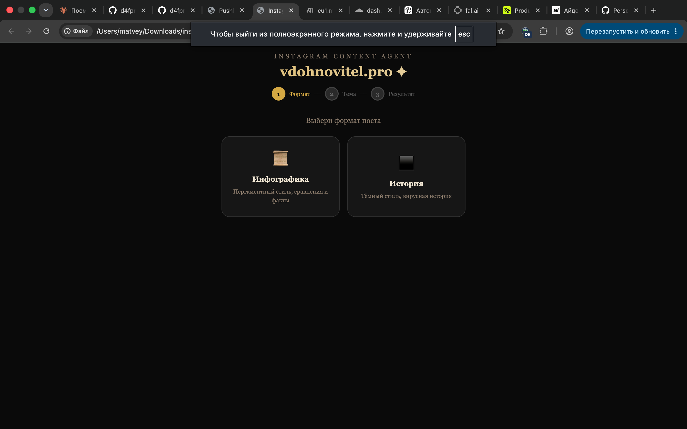
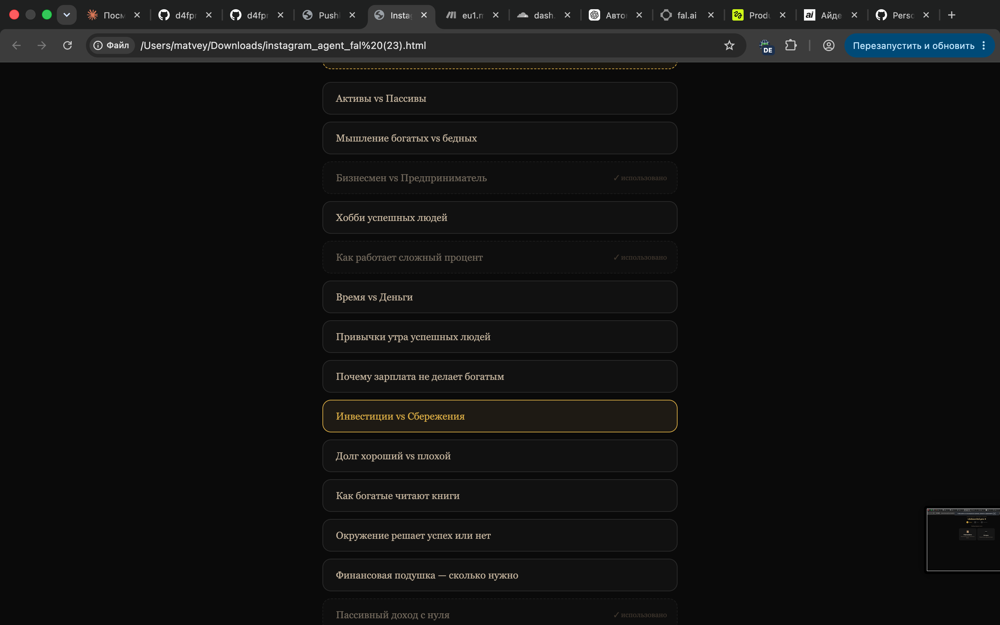
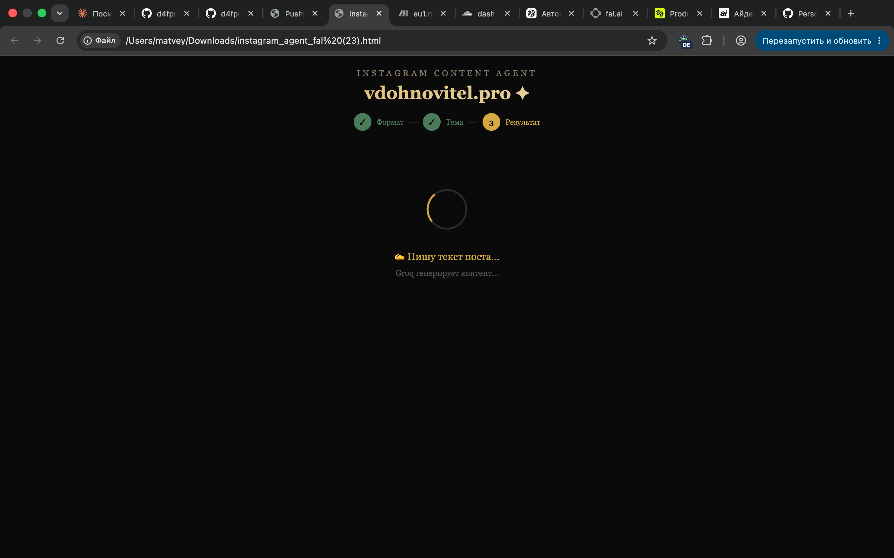
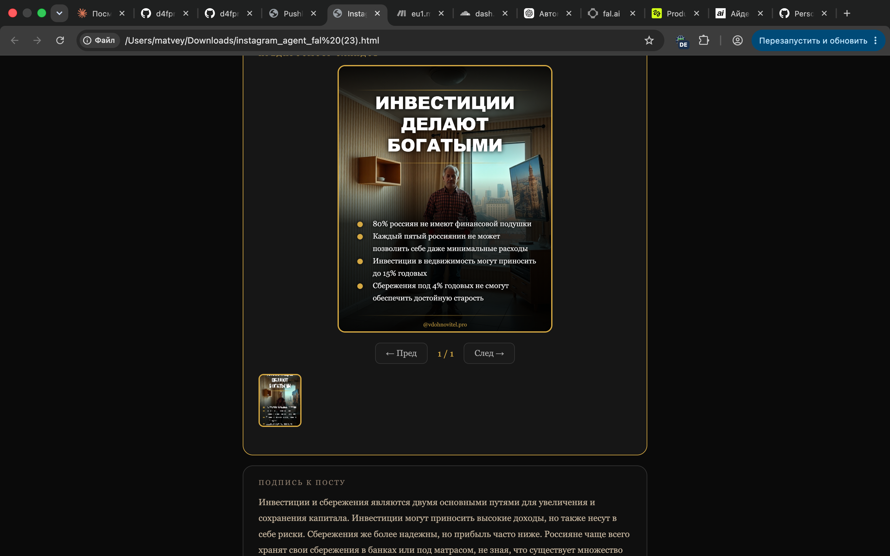
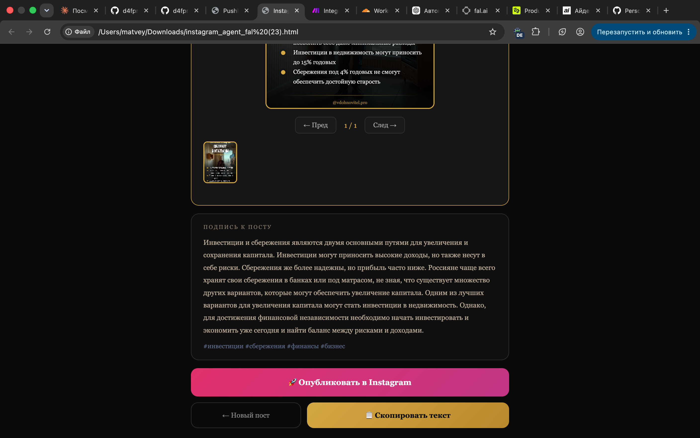
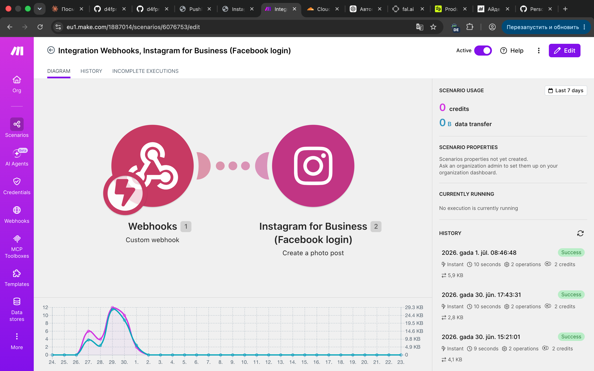
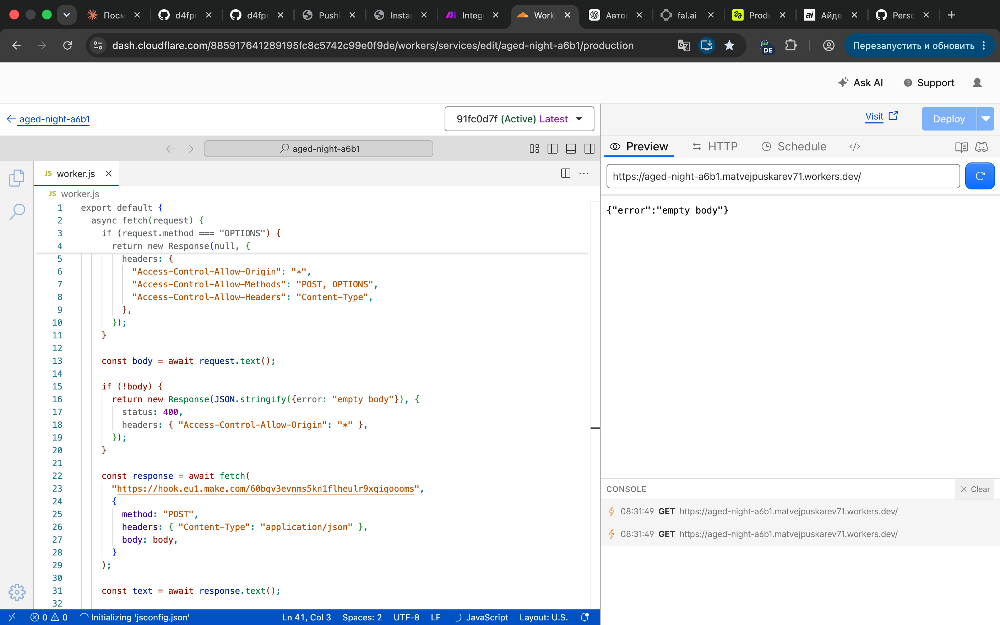
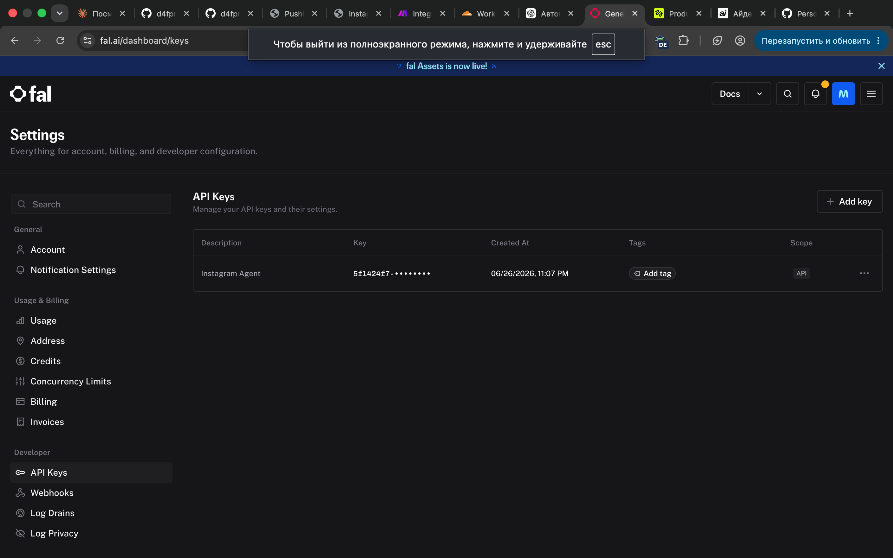

# Blogger Outreach Agent

Инструмент для поиска блогеров под бартер-коллаборации: анализирует эталонные профили из таблицы, строит их "портрет", ищет похожих новых блогеров и пишет для каждого персональный оффер.

## Навигация по проекту

| Часть | Что это | Ссылка |
|---|---|---|
| Схема автоматизации | Визуализация pipeline (Mermaid, рендерится прямо в GitHub) | [`scheme/pipeline.md`](./scheme/pipeline.md) |
| Скрипт | Рабочий Python pipeline: таблица → портрет → поиск → офферы | [`scripts/main.py`](./scripts/main.py) |
| Промпты | 3 промпта, использованные для анализа и генерации | [`prompts/`](./prompts) |
| Демо-результат | Пример прогона на данных из таблицы | [`output/example_result.md`](./output/example_result.md) |

## Как это работает (коротко)

1. Скрипт читает Google Sheets с эталонными блогерами
2. Собирает данные по каждому профилю
3. Отправляет их в Claude API → получает структурированный "портрет идеального блогера"
4. Ищет новых кандидатов и скорит каждого относительно портрета
5. Для подходящих кандидатов (match score > 70) генерирует персональный оффер
6. Сохраняет результат в `output/result.md`

Подробная схема с разбивкой по автоматическим и ручным шагам — в [`scheme/pipeline.md`](./scheme/pipeline.md).

## Как запустить

```bash
cd scripts
pip install -r requirements.txt
export ANTHROPIC_API_KEY="sk-ant-..."
export GOOGLE_SHEET_CSV_URL="https://docs.google.com/spreadsheets/d/<ID>/export?format=csv&gid=0"
python main.py
```

Результат появится в `output/result.md`.

## Ограничения текущей версии

У Instagram/YouTube/Telegram нет официального публичного API для чтения контента чужих профилей и "поиска по эстетике". Поэтому в pipeline есть два места, где нужен внешний источник данных, помеченные прямо в коде:

- **`fetch_profile_data()`** — сбор данных по эталонным профилям. Рабочий вариант: Apify actor `instagram-scraper`, либо ручной сбор в CSV.
- **`search_candidates()`** — поиск новых кандидатов. Рабочий вариант: API инфлюенс-платформы (Perfluence / Modash / HypeAuditor) или Apify-скрапинг по хэштегам/гео из "поисковых критериев" портрета.

## Затраченное время (по частям)

| Часть | Оценка трудозатрат |
|---|---|
| Анализ задачи и выбор архитектуры pipeline | ~30 минут |
| Промпты (портрет / скоринг / оффер) с итерациями | ~1-1.5 часа |
| Скрипт `main.py` целиком (чтение таблицы, обёртка над Claude API, точки подключения внешних источников) | ~2 часа |
| Схема автоматизации | 1,5 часа |
| Демо-прогон и оформление результата | 1,5 часа |
| Сборка README и структуры репозитория | 1,5 часа |

## Задание 2

Моё мнение — самое важное здесь время. Если в качестве примера взять генерацию карточек товара, то это ключевой момент: товар приехал на склад, и в идеале уже через несколько часов должен появиться в продаже с качественными фотографиями и точным, привлекательным описанием. Поэтому я считаю этот процесс одним из самых важных.

Инструменты, которые для этого нужны:
- каталог товаров
- фотографии товаров
- описания
- основной ИИ — GPT или Claude (предпочтительнее Claude)
- система контроля качества и хранения контента

Оценивать, работает ли решение, должны люди, которые раньше сами писали и создавали карточки — если автоматизированный «помощник» справляется на том же уровне, значит всё работает. (Важная оговорка: рука человека всегда важна, и, на мой взгляд, обучить ИИ писать тексты с ноткой человечности сложно, но возможно.)

Лучшая метрика успеха — скорость выкладки: если раньше карточка выкладывалась в среднем за 5 часов, а через месяц среднее значение снизилось до 3 часов — значит, всё прошло хорошо.

## Задание 3

У меня есть агент, который автоматически создаёт и публикует посты в Instagram.

Моё хобби уже несколько лет — несколько аккаунтов в Instagram с юмористическим контентом, но поскольку это хобби, не всегда находилось время на написание и редактирование. Моё второе хобби — ИИ, и я решил скрестить эти идеи и посмотреть, что получится.

По итогу всё получилось: если раньше мне нужно было часа 2-3, чтобы написать пост и отредактировать картинку, то теперь — 1 минута, и остаётся только нажать «опубликовать».

Инструменты, которые поддерживают работу агента:
- **Make** — основная платформа, которая публикует в Instagram; она получает готовый текст и изображение
- **Groq** — отвечает за текст, был немного дообучен и периодически дообучается заново, потому что иногда выдаёт странности вроде «бюджет это vazhно»
- **Fal.ai** — отвечает за изображения (по API-ключу), тоже немного дообучен под определённую специфику
- **Cloudflare** — выступает как маршрутизатор

**Скриншоты работы агента:**









