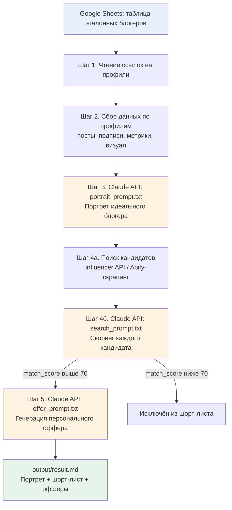

# Схема автоматизации

**Ручные точки в текущей версии** (см. `README.md`, раздел "Ограничения"):
- Шаг 2 требует подключения источника данных (Apify actor или ручной сбор в CSV)
- Шаг 4а требует подключения платного API инфлюенс-платформы или скрапера

Всё остальное — Шаги 3, 4б, 5 — выполняется автоматически через Claude API без участия человека.
